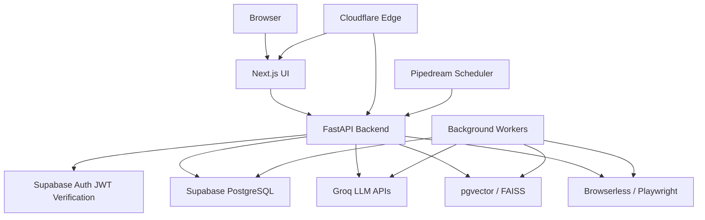
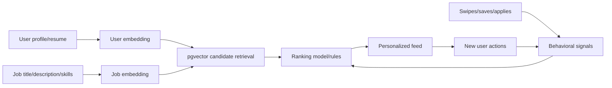
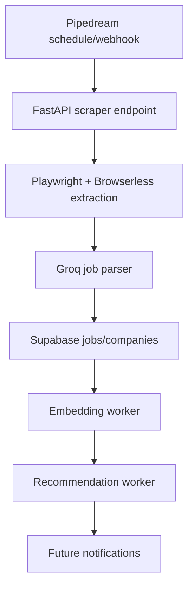

# FastAPI Target Architecture

## Goal

Kareerly should become an AI-native Career Intelligence Platform with a stable Next.js frontend and a Python-owned backend. The frontend stays focused on UI. FastAPI owns auth verification, jobs, recommendations, AI services, scraping, analytics, workers, and production APIs.

This direction intentionally favors backend and AI complexity over frontend complexity because the project should showcase Python, FastAPI, AI/ML, scraping, data engineering, and production architecture.

## Target System



## Backend Structure

```text
backend/
  app/
    main.py
    api/
      auth/
      jobs/
      resume/
      matching/
      recommendations/
      scraper/
      analytics/
      interview/
    core/
      config.py
      security.py
      logging.py
      errors.py
    db/
      session.py
      models.py
      migrations/
    schemas/
    repositories/
    services/
    middleware/
    workers/
    tests/
```

## Service Boundaries

### Auth Service

Responsibilities:

- Verify Supabase JWTs from frontend requests.
- Provide `GET /auth/me`.
- Support roles and request-scoped user context.
- Avoid replacing Supabase login UI initially.

Why this exists:

- Keeps the existing login flow working.
- Lets FastAPI safely own protected backend APIs.

### Job Feed Service

Responsibilities:

- `GET /jobs`
- `GET /jobs/{id}`
- `GET /jobs/feed`
- `POST /jobs/save`
- `DELETE /jobs/save/{id}`
- `POST /jobs/apply`
- `GET /jobs/bookmarks`

Design:

- Start by matching existing Next API response shapes.
- Add pagination, filtering, search, and sorting after parity.
- Preserve Supabase tables where possible.

### Resume Service

Responsibilities:

- `POST /resume/upload`
- `POST /resume/tailor`
- `GET /resume/history`
- `GET /resume/{id}`
- `DELETE /resume/{id}`

Design:

- Store tailored resume versions.
- Keep prompts in managed templates.
- Save model, prompt version, input metadata, and output markdown.
- Prepare for future PDF generation.

### Matching Service

Responsibilities:

- `POST /matching/score`
- Score resume/job fit.
- Return structured match score, missing skills, why matched, and resume gaps.

Design:

- Use Pydantic response models so output is interview-defensible and testable.
- Separate deterministic features from LLM-generated explanation.

### Recommendation Service

Responsibilities:

- `POST /recommendations/generate`
- `GET /recommendations/user/{id}`
- Candidate retrieval, ranking, reranking, and freshness decay.

Design:

- Use pgvector for persisted vector search.
- Use FAISS for experimentation or offline batch reranking.
- Use BAAI/bge-small-en-v1.5 and MiniLM as embedding options.
- Incorporate swipes, saves, applies, recency, skills overlap, and profile fit.

### Scraper Service

Responsibilities:

- `POST /scraper/run`
- `POST /scraper/company/{name}`
- `GET /scraper/status`
- `GET /scraper/history`

Design:

- Move script-driven scraping into API-triggered jobs.
- Use Browserless for hosted browser execution.
- Add retries, deduplication, structured logs, and failure states.

### Analytics Service

Responsibilities:

- `GET /analytics/user`
- `GET /analytics/jobs`
- `GET /analytics/skills`

Design:

- Track application funnel metrics.
- Track skill demand trends.
- Track recommendation quality and conversion.

### Interview Copilot Service

Responsibilities:

- `POST /interview/generate`
- `POST /interview/mock`
- `POST /interview/feedback`

Design:

- Turn a job description and user profile into personalized preparation.
- Generate technical, HR, system design, and coding questions.
- Store sessions and performance over time.

## Data Access Strategy

Use async SQLAlchemy for backend-owned queries. Keep Supabase Auth as the identity provider. The backend can use direct Postgres connections for application queries and Supabase service-role access only for controlled server-side operations.

Repository pattern:

- repositories own SQL and table access.
- services own business logic.
- API routers own request/response mapping.

This separation is important for interviews because you can clearly explain where auth, data access, business logic, and AI orchestration live.

## Recommendation Engine Design



Initial ranking features:

- embedding similarity
- skills overlap
- experience fit
- role preference match
- freshness score
- user action history
- company diversity

Why pgvector and FAISS:

- pgvector is production-friendly because embeddings live next to Postgres data.
- FAISS is useful for local experiments, offline reranking, and interview discussion around vector indexes.

## Automation Pipeline



## Frontend Rule

Do not rewrite the frontend unless required for API integration. Existing pages should call FastAPI through a thin client adapter once backend parity exists.

## First Implementation Slice

The first backend implementation should be small and production-shaped:

1. `backend/` skeleton.
2. Health endpoint.
3. Config and logging.
4. Supabase JWT verification.
5. `GET /auth/me`.
6. `GET /jobs/feed` with current response parity.
7. Tests for auth and feed.

This gives a clean foundation without breaking the current UI.
